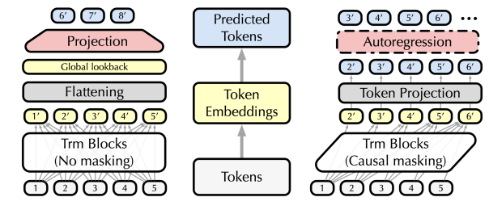
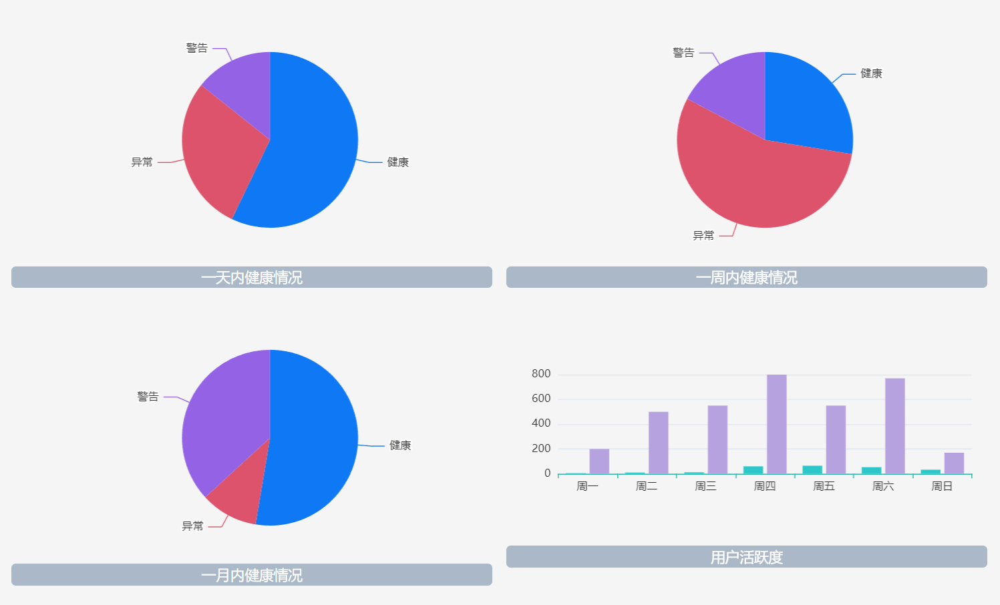
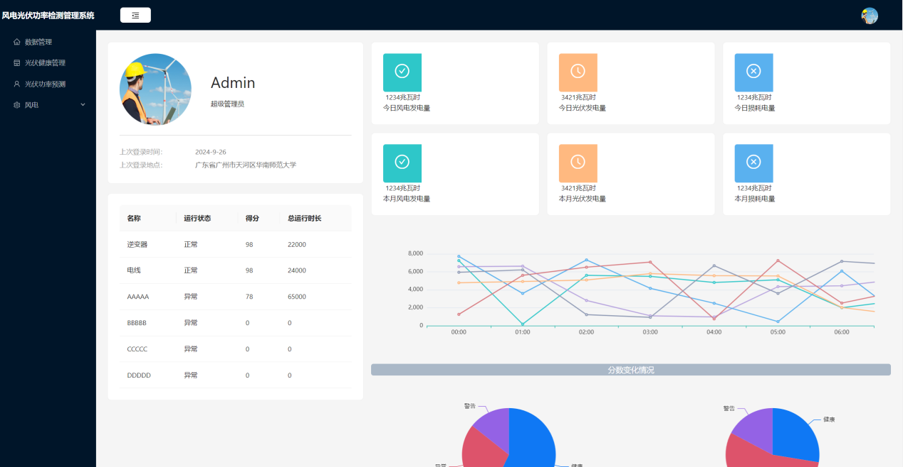
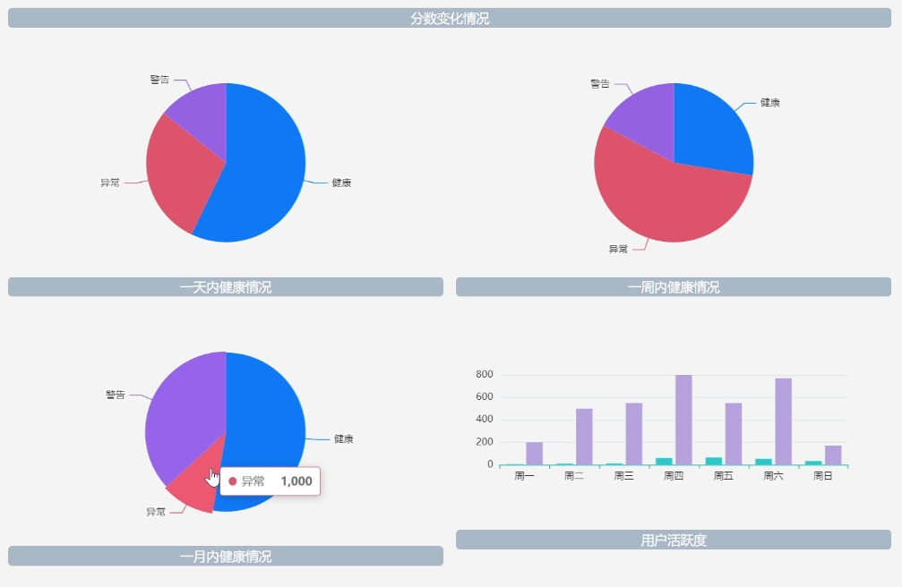
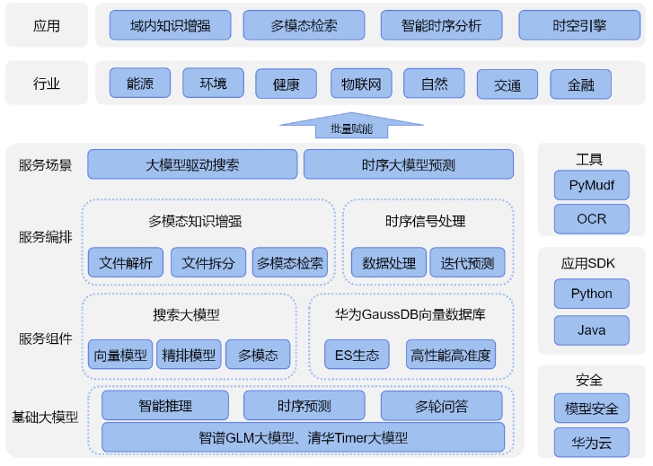
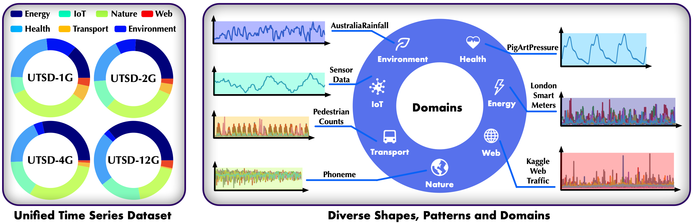
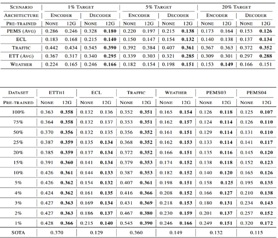

<<<<<<< HEAD
# 风电时序系统
该风光一体化预测系统旨在应对工业领域的多重挑战，采用基于生成式Transformer解码器架构的大模型。借助MindSpore框架的分布式计算能力，系统在大规模风电和光伏时序数据上进行预训练。通过整合实时数据，系统实现了精确的风能和光能发电量预测，并提供设备状态监测、智能告警和运行评估等功能。

## 研究理论

### 风电光伏一体化研究理论

风力发电功率和光伏发电功率之间存在复杂且相关的联系。例如，白天日光强时风力通常较小，夜晚温差大时风力增强。此外，高风速可能对光伏系统的结构和稳定性产生负面影响，但同时也能带走光伏电池表面的热量，影响功率输出。为了量化两者之间的相关性，常用 Pearson 相关系数来描述变量间的关联性，并筛选与发电功率密切相关的因素。

<p align="center">

</p>

### 模型概述

该模型基于生成式Transformer，仅使用解码器结构，通过自回归预测实现短期、中期和长期的发电量预测。模型输入包括实时天气、历史发电量和设备状态数据，经过统一处理后逐时间步进行预测。输出为未来的发电量预测值，能够多步迭代预测，灵活且可扩展。主要特点有：自回归生成方法保证多时间步预测的准确性；并且模型能够处理长时间序列的数据，适用于长时间范围内的发电量预测。

<p align="center">

</p>


## 预训练策略

该系统在预训练阶段依托大规模时序数据进行预训练，提升模型在数据稀缺场景下的泛化能力。基于生成式Transformer的架构，参考了Timer模型的设计。数据预处理中，清洗风电和光伏发电的历史数据，处理缺失和异常值后，将多变量时序数据转换为统一的S3格式，并归一化以消除变量间的尺度差异。在生成式预训练中，模型通过自回归方法，使用历史数据窗口预测未来发电量，每个时间步作为一个“token”输入。预训练数据集包含约十亿个时间点的多领域时序数据，使模型具备较强的预测能力和泛化性。


## 实验结果展示

该系统通过便捷的登录功能，帮助用户轻松管理风电光伏预测系统，简化了登录流程，提升了工作效率。系统能够记录并展示一天、一周、一月内的预测健康状态，同时追踪用户活跃度，便于用户监控系统运行情况并及时发现问题。此外，活跃度数据有助于系统管理员优化运维，提升系统的效率与可靠性。

<p align="center">

</p>
<p align="center">

</p>


=======
# 基于华为MindSpore的多模态时序大模型-新能源时空智能引擎
## 项目简介
本项目创新性地提出了新能源行业AI一站式解决方案，基于华为Mindspore深度学习框架和云服务构建，涵盖风/光功率预测、电力市场预测、智能知识沉淀等功能，并提供题库生成与智能批改的扩展应用。方案广泛适用于能源、环境、物联网等多个领域，具备高适配性和安全性，可通过微调快速迁移应用。
## 功能展示
### 视频演示
<video width="400" height="300" controls>
  <source src="./figures/video.mp4" type="video/mp4">
  你的浏览器不支持视频标签。
</video>

### 管理员界面
展示前端功能页面。
<p align="center">

</p>

### 检测检测情况
检测不同的时间段模型预测情况。
<p align="center">

</p>

## 系统框架
### 主要组件功能
*搜索规划：利用LLM的query分类，多轮改写，复杂查询分解，实现精准搜索。

*时序预测：使用Transformer架构进行时序信号预测，实现工业领域长短期精准预测

*企业知识库：使用搜索增强生成RAG解决私域知识融合、大模型落地中的幻觉、时效性

*专业题库：利用LLM智能推理能力与概括归纳能力，实现出题批改，有效提高员工专业知识水平
<p align="center">

</p>


## 数据集
使用Unified Time Series Datasets (UTSD)以促进大型时间序列模型和预训练的研究。数据集可在[huggingface](https://huggingface.co/datasets/thuml/UTSD)获取，以方便时间序列领域大型模型的研究和预训练。

<p align="center">

</p>

## 安装与启动
### 使用 Docker 启动项目

1. 创建项目文件夹并进入目录：

   ```bash
   mkdir SeqProject
   cd SeqProject
2. 启动docker

   ```bash
   docker-compose up

## 评估结果

选择仅解码器结构，对比其它已有的模型和结构，较普通模型具有极强泛化性仅用少量的数据便能击败SOTA模型。

<p align="center">

</p>
>>>>>>> 15d50d09666c0f1820500907f6e1a55b4753574c
