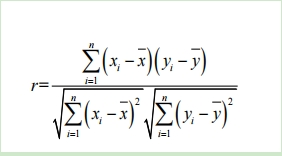

# 风电时序系统

该风光一体化预测系统旨在应对工业领域的多重挑战，采用基于生成式 Transformer 解码器架构的大模型。借助 MindSpore 框架的分布式计算能力，系统在大规模风电和光伏时序数据上进行预训练。通过整合实时数据，系统实现了精确的风能和光能发电量预测，并提供设备状态监测、智能告警和运行评估等功能。

## 研究理论

### 风电光伏一体化研究理论

风力发电功率和光伏发电功率之间存在复杂且相关的联系。例如，白天日光强时风力通常较小，夜晚温差大时风力增强。此外，高风速可能对光伏系统的结构和稳定性产生负面影响，但同时也能带走光伏电池表面的热量，影响功率输出。为了量化两者之间的相关性，常用 Pearson 相关系数来描述变量间的关联性，并筛选与发电功率密切相关的因素。

### 模型概述

该模型基于生成式 Transformer，仅使用解码器结构，通过自回归预测实现短期、中期和长期的发电量预测。模型输入包括实时天气、历史发电量和设备状态数据，经过统一处理后逐时间步进行预测。输出为未来的发电量预测值，能够多步迭代预测，灵活且可扩展。主要特点有：自回归生成方法保证多时间步预测的准确性；并且模型能够处理长时间序列的数据，适用于长时间范围内的发电量预测。

## 预训练策略

该系统在预训练阶段依托大规模时序数据进行预训练，提升模型在数据稀缺场景下的泛化能力。基于生成式 Transformer 的架构，参考了 Timer 模型的设计。数据预处理中，清洗风电和光伏发电的历史数据，处理缺失和异常值后，将多变量时序数据转换为统一的 S3 格式，并归一化以消除变量间的尺度差异。在生成式预训练中，模型通过自回归方法，使用历史数据窗口预测未来发电量，每个时间步作为一个“token”输入。预训练数据集包含约十亿个时间点的多领域时序数据，使模型具备较强的预测能力和泛化性。

## 实验结果展示

该系统通过便捷的登录功能，帮助用户轻松管理风电光伏预测系统，简化了登录流程，提升了工作效率。系统能够记录并展示一天、一周、一月内的预测健康状态，同时追踪用户活跃度，便于用户监控系统运行情况并及时发现问题。此外，活跃度数据有助于系统管理员优化运维，提升系统的效率与可靠性。

